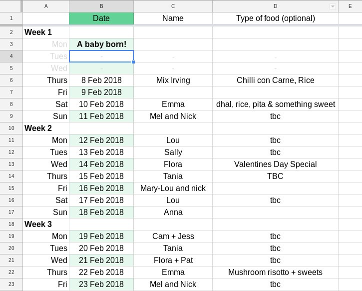

# Meals Roster for young families

When our daughter was born, our good friend Gina Rembe organised for friends to deliver home cooked meals for a month.
It's pretty hard to convey how amazing this was - simultaneously the most practical and personal gift we could have received.

I've since paid this gift forward for another friend, and want to empower others to do the same.

## Steps

This isn't complicated, but working with people and writing carefully can take a bunch of time and energy.
Hopefully this makes your life easier.

### 1. Propose the idea

The idea is to make this easy for them, tell them the plan is:
- collect emails
- send people and email inviting them to join the roster
- they get food delivered
- you'll handle all the details

Exepecting parents might have a lot on their minds.
I would recommend being a little opinionated and _telling_ them you're going to organise this as your gift to them.

### 2. Send the invitation out

1. set up the meal roster spreadsheet somewhere online
2. tune the invitation email, then check it's ok with the family
  - **also check about any food requirements** (e.g. allergies, dietary restrictions)
3. send it out!

Templates: 
  - email I sent - [invitation.md](invitation.md)
  - meal roster - [meal_roster.csv](meal_roster.csv) | [google spreadsheets version](https://docs.google.com/spreadsheets/d/1z3fQdPHAPE_X6cvOC9jl6Ul1aP13hEWBDHP2lE6KfFU/edit?usp=sharing)
    - it's got blank dates in it, you'll put real dates in when the baby is born
    - the online shops are New Zealand based ones

Notes:
  - I had the invitation sent out about 3 weeks before the due date (because babies can and do arrive early!)
  - I CC'd the whole list of friends. This was partly so people knew who I was, and partly to make subsequent announcements easy.

### 3. Send the ALL SYSTEMS GO! email

Keep in touch with one person in the family (probably the one not pregnant) to know when they're likely to be home from the hospital (can take 2-5 days).

1. update the dates in the spreadsheet
  - do it manually
  - OR use a fancy spreadsheet formula (you can see how I did it in the second tab of the [google spreadsheet](https://docs.google.com/spreadsheets/d/1z3fQdPHAPE_X6cvOC9jl6Ul1aP13hEWBDHP2lE6KfFU/edit?usp=sharing))

Templates:
  - email to announce go live - [go_live.md](go_live.md)

